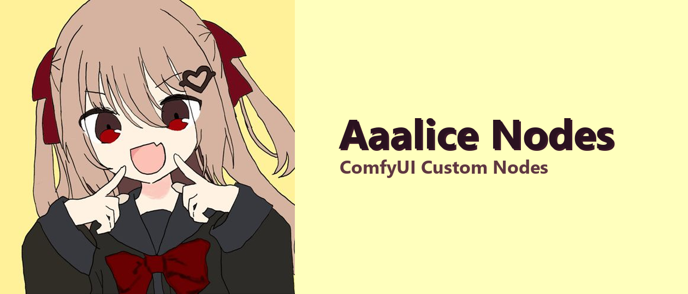

<p align="center">
  
</p>

<p align="center">
  <b>English</b> · <a href="./README.zh-CN.md">简体中文</a>
</p>

# ComfyUI-Aaalice-Nodes

Compact parameter controls and workflow utilities for ComfyUI.

> This package is a published preview. Workflows and behavior may change before the first stable release. Legacy workflows are not migrated automatically; the Library can import the supported legacy prompt-library exports described below.

## Requirements

- A current ComfyUI installation with V3 custom-node support.
- Classic canvas or Nodes 2.0. App Mode is not currently supported.
- English and Simplified Chinese UI are included; other locales fall back to English.

## Interface behavior

- Node surfaces preserve ComfyUI's native background, outline, and rounded corners in both Classic and Nodes 2.0.
- Ordinary active controls, including sliders and boolean switches, adapt to the node's selected color. Neutral, warning, error, filtering, and multi-mode states keep their own meaning instead of being recolored indiscriminately.

## Installation

### ComfyUI Manager (recommended)

1. Open **ComfyUI Manager** and go to the custom-node management page.
2. Search for `ComfyUI-Aaalice-Nodes` or the Registry package id `comfyui-aaalice-nodes`.
3. Select **Install**, then restart ComfyUI and refresh the browser.

Manager installs the published [`comfyui-aaalice-nodes`](https://registry.comfy.org/nodes/comfyui-aaalice-nodes) package and its declared dependencies. Use Manager for normal installation and updates.

### Manual Git installation

Use Git when you need the latest development revision or a specific commit. Clone the repository into `ComfyUI/custom_nodes`, install dependencies with the Python environment used by ComfyUI, and restart:

```bash
cd ComfyUI/custom_nodes
git clone https://github.com/Aaalice233/ComfyUI-Aaalice-Nodes.git
cd ComfyUI-Aaalice-Nodes
pip install -r requirements.txt
```

## Updating and troubleshooting

- Registry installations should be updated through ComfyUI Manager.
- Manual Git installations can be updated with `git pull` from this repository directory.
- Restart ComfyUI after Python updates and hard-refresh the browser after frontend updates.
- If an existing node keeps an old socket or widget structure after a structural update, remove that node instance and create it again.

## Included nodes

| Node | Category | Purpose |
|---|---|---|
| `ParameterPanel` | `Aaalice/control` | Manage one parameter set and expose its active values as direct outputs. |
| `ParameterReceiver` | `Aaalice/control` | Bind a ParameterPanel and collect its KJ Get values behind one compact output surface. |
| `QuickGroupManager` | `Aaalice/control` | Enable, mute, or bypass color-scoped visual groups with ordering and linkage rules. |
| `EnumSwitch` | `Aaalice/tools` | Execute and output one branch selected by an exact string value. |
| `ResolutionPreset` | `Aaalice/tools` | Pick an exact aligned width and height with presets, direct input, or a draggable canvas. |
| `SimpleStringSplit` | `Aaalice/tools` | Split text by comma or pipe, trim whitespace, and remove empty parts. |
| `SimpleNotify` | `Aaalice/tools` | Send optional desktop and sound alerts at an execution point, then pass its value through. |
| `PromptCleaningMaid` | `Aaalice/prompt` | Quickly disable cleaning, safely clean natural-language prompts, or normalize and deduplicate flat tag lists. |
| `PromptSelector` | `Aaalice/prompt` | Select, order, and weight reusable entries from the prompt library. |
| `CharacterFeatureSwapNode` | `Aaalice/prompt` | Transfer selected character features while preserving the original prompt's language and format. |
| `PromptAssistantBridge` | `Aaalice/prompt` | Expand the incoming prompt with prompt-assistant's active rule and service during execution. |
| `BooruGalleryNode` | `Aaalice/gallery` | Search Danbooru, Gelbooru, Safebooru, and AI TAG in a virtual masonry gallery and output ordered images with paired prompts. |
| `FetchFromKrita` | `Aaalice/krita` | Read the visible composite and selection of Krita's active document as `IMAGE` and `MASK`. |

<details>
<summary><strong>EnumSwitch — lazy enum routing</strong></summary>

- Match `selector` against 1–32 exact branch keys; unmatched or unconnected branches fail visibly.
- Only configured branches appear as input sockets, so unused capacity cannot affect node sizing or mouse interactions.
- Only the selected lazy branch executes, and every branch shares one inferred connection type.
- Right-click and choose **⚙️ Edit Branches…** for standalone use.
- A direct enum/dropdown output from ParameterPanel or ParameterReceiver is detected automatically. When its options change, the warning icon offers an explicit sync that preserves unchanged branch links.

</details>

<details>
<summary><strong>ResolutionPreset — exact aligned dimensions</strong></summary>

Choose one of nine model-neutral built-in sizes, save personal presets, enter width and height directly, or drag the width, height, and corner handles on the canvas. The node outputs exact `INT` width and height values and can be connected to nodes such as `EmptyLatentImage`.

Alignment can be set to 8, 16, 32, or 64 pixels. Invalid direct input keeps the previous value and offers the nearest legal size. The drag range can be 2048, 4096, or 8192 and expands automatically when a completed edit needs more space. Personal presets retain their own alignment and are stored in the current ComfyUI user directory.

The ratio and megapixel text are read-only summaries. This node does not calculate a target size from megapixels, recommend models, create images or Latents, or perform cropping, scaling, or batching. Use ComfyUI's `ResolutionSelector` when ratio-plus-megapixel calculation is the desired workflow.

</details>

<details>
<summary><strong>FetchFromKrita — execution-time Krita snapshot</strong></summary>

The node has no inputs. Every execution reads the visible composite of Krita's current active document and returns it as `IMAGE`; the current selection is returned as a same-size `MASK`. With no selection, the mask is fully black. A real selection that happens to be fully black remains a valid selection instead of being treated as absent.

Close Krita, then open **ComfyUI Settings → Aaalice Nodes → Krita** to install and enable, or repair and re-enable, the bundled `Aaalice Comfy Bridge`. The action updates Krita's plugin setting automatically; start Krita afterward and test the connection. Bridge status and the last fetch summary are interface-only and never enter workflow JSON.

Krita, ComfyUI, and the Bridge must run on the same machine. Missing Bridge, offline Krita, no active document, incompatible protocol, export failure, timeout, or invalid media fails the node explicitly; it never returns an old snapshot, placeholder image, or fallback input. The node does not launch or close Krita, choose among documents or layers, wait for editing, or provide a two-way editing session.

</details>

<details>
<summary><strong>ParameterPanel — parameter authoring and direct outputs</strong></summary>

New panels contain `Steps`, `CFG`, `Sampler`, `Scheduler`, `Denoise`, and `Seed`. Sampler and scheduler options follow the current ComfyUI installation.

- Change values directly on the node.
- Right-click the node and choose **⚙️ Edit Parameters…** to add, rename, reorder, copy, delete, or document parameters.
- Custom enum and dropdown options use one value per line and must be unique.
- Image parameters accept either a file-picker selection or an image dragged from the desktop or file manager.
- Connect each visible output directly to the matching downstream input. Links stay with the same parameter when it is renamed or reordered.
- Seed supports fixed, increment, decrement, and randomize behavior. The inline lock button switches between fixed and randomize for quick use.
- If KJ Set/Get is installed, **🔗 Create and link KJ Set nodes for all parameters** is available from the node menu. Newly created collapsed Set nodes are arranged in a compact column to the panel's right.

Deleting a connected parameter requires confirmation because its links must be removed. A panel can contain at most 32 value-producing parameters; separators do not create outputs. Only value-producing parameters appear as output sockets.

</details>

<details>
<summary><strong>ParameterReceiver — compact KJ Get receiver</strong></summary>

`ParameterReceiver` requires KJNodes Set/Get support for binding and synchronization. Create the receiver in the same graph as its source panel, then right-click it and choose **🔗 Bind Parameter Panel…**.

- The first bind reuses existing KJ Set nodes and asks before creating missing ones. Matching collapsed Get nodes are arranged to the receiver's left.
- Parameter renames and panel-title changes refresh labels automatically. Adding, deleting, or reordering parameters changes the footer to **Needs sync**; use **🔄 Sync from Parameter Panel** to apply structural changes.
- Adding parameters at the end leaves existing connections untouched. Middle insertions and reordering keep surviving connections attached to the same parameters.
- The receiver shows only the input and output sockets in its current binding, so unused capacity cannot interfere with resizing or connection gestures.
- **🎯 Locate Parameter Panel** centers the bound source. **✂️ Detach** removes receiver-only managed Gets after confirming affected links.
- If the source panel is deleted, the receiver keeps its configured sockets and current connections, reports **Source panel missing**, and can be explicitly rebound.

KJNodes is optional for the package as a whole. Without it, ParameterReceiver workflows still load, but bind and sync report an error instead of simulating routing.

</details>

<details>
<summary><strong>QuickGroupManager — fast visual-group control</strong></summary>

QuickGroupManager does not run as part of workflow execution and has no input or output sockets. It discovers visual groups in its current graph and gives every managed group one enabled switch. The node-wide **Mute / Bypass** switch determines how an off group is represented.

- Use the filter icon to manage all groups, multiple group colors, or uncolored groups. Its active color reflects the current filter, while group rows stay compact without repeated color swatches. Multiple managers may use independent color scopes.
- Drag group rows to reorder them; filtered lists remain sortable and each manager saves its own order.
- Use the frame icon on any row to fit that complete visual group in the canvas.
- Open the link icon on a row to configure what other groups should do when that group is enabled or disabled. Rules may target other colors and cascade only within the manager that initiated the change.
- Switching Mute / Bypass converts currently disabled groups in that manager's active color scope as one undoable change.
- External group changes and other managers update the display but do not trigger linkage rules.

The node controls only groups in its current graph. A grouped subgraph node can be switched like any other node, but QuickGroupManager does not recurse into the subgraph's internal graph.

</details>

<details>
<summary><strong>SimpleNotify — execution-point alerts</strong></summary>

Connect any value to receive one alert when execution reaches the node, then continue with the unchanged value. Desktop notifications and the bundled sound can be enabled independently, and sound volume is configurable. Use **🔔 Enable and Test Alerts** from the node menu to request browser permission and test the enabled channels.

The alert confirms only that execution reached this node. It does not wait for other parallel branches or for the queue to become empty. Browser/API restrictions can prevent desktop notifications or audio; headless API and CLI runs have no frontend alert surface.

</details>

<details>
<summary><strong>PromptCleaningMaid — format-aware prompt cleaning</strong></summary>

Connect prompt text, then use the compact switcher to choose **Off**, **Natural language**, or **Tag list**. Off mode is an exact pass-through for quickly disabling every cleaning effect; switching modes preserves both cleaning configurations. Natural-language mode is the safe default and only cleans enabled outer, line-end, and blank-line whitespace. Tag-list mode recognizes top-level English/Chinese commas and line breaks, preserves nested syntax, and can trim, remove empty entries, and stably deduplicate tags. Inputs containing the recognized top-level partition controls `BREAK`, `AND`, `ADDCOL`, `ADDROW`, `ADDBASE`, or `ADDCOMM` are passed through byte-for-byte instead of being normalized or deduplicated.

The settings button opens mode-specific toggles and marks the node when defaults have been customized. The node never removes LoRA tags, completes weights, repairs brackets, or auto-detects prompt formats. It preserves the recognized partition controls above without interpreting or repairing their syntax; unknown third-party control words are not auto-detected. Malformed tag-list structure is returned unchanged.

</details>

<details>
<summary><strong>PromptSelector — ordered prompt-library selection</strong></summary>

Use search and the category or favorite-folder filters, then select any number of entries across categories. With ComfyUI-Autocomplete-Aaalice installed, the search box also offers its tag and Chinese completion. The list shows prompts used in the most recently queued workflows first; the clock button restores manual library order. Recent-use history stays with the current ComfyUI user's library and is not included in workflows or library backups. Each row uses its preview thumbnail as the selection target; a check overlay shows the selected state, while entries without an image use a non-previewing placeholder. Hover or focus an image-backed entry to inspect a larger preview. The row actions open the entry editor or add it to a chosen favorite folder; clicking an active favorite again removes all favorite memberships from that entry. Selection order belongs to the node and determines output order. Hover a selected entry to reveal its weight control: scroll or use arrow keys to adjust it, hold `Shift` for fine adjustments, or click to reset it to `1`; the valid range is 0–20. The optional `prefix_prompt` input is emitted first, and the node context menu can change the separator, which defaults to `, `.

PromptSelector stores stable entry references instead of copied text. Editing a library entry updates every referencing node. Deleting a referenced entry leaves a visible missing reference and blocks execution until it is removed or restored; it is never silently matched by name.

</details>

<details>
<summary><strong>BooruGalleryNode — multi-site ordered gallery</strong></summary>

Choose Danbooru, Gelbooru, Safebooru, or AI TAG, search and filter posts, then select across an automatically loading natural-ratio masonry gallery. Danbooru exposes today's, weekly, and monthly ranking channels; AI TAG exposes its monthly ranking. The compact page control tracks the visible result page, returns to page 1 on refresh, and can jump directly without loading every earlier page. The Selected view preserves order, supports drag reordering and removal, and lets each selected post edit its local Artist, Copyright, Character, General, and Meta tags without modifying the remote post. AI TAG uses its public work metadata and exposes its image prompt as General tags; it has no artificial Rating mapping. `images` and `prompts` are paired lists in that exact order; one failed original download fails the node instead of inserting a placeholder or skipping the item.

Configure site credentials, defaults, the global content blacklist, new-node prompt defaults, request timeout, hover details, and the original-image cache budget under **ComfyUI Settings → Aaalice Nodes → Booru Gallery**. The blacklist hides exact tag matches from search, ranking, and favorite results without changing generated prompts or existing selections. Credentials and caches stay in the current ComfyUI user directory and never enter workflow JSON. Gelbooru currently requires its official User ID and API Key for gallery access; when they are missing, the node links directly to Gallery settings instead of issuing a failing anonymous request. Danbooru supports favorite reading and writing; Gelbooru favorite reading is available but writing is disabled; Safebooru and AI TAG account favorites are not supported. When [ComfyUI-Autocomplete-Aaalice](https://github.com/Aaalice233/ComfyUI-Autocomplete-Aaalice) is installed, the gallery search box offers its tag and Chinese completion, and the post detail shows its dictionary, cache, and DeepSeek tag translations under each tag in a Chinese interface; without it, tags stay plain English. Every card can copy its prompt in one click, and when [prompt-assistant](https://github.com/yawiii/ComfyUI-Prompt-Assistant) is installed, cards can also interrogate the image through its vision analysis; the post detail can copy the image itself to the clipboard. The node still does not bundle a full tag database, remote tag editing, cookie login, or a legacy workflow/settings migration layer.

</details>

<details>
<summary><strong>CharacterFeatureSwapNode — LLM character-feature transfer</strong></summary>

Connect the original prompt and a reference character prompt, then use the compact feature chips to choose what should be transferred. Chips can be enabled, disabled, reordered, removed, or extended with custom feature descriptions. The same default instruction handles natural language, tag lists, and mixed prompts; the result follows the original prompt's language and formatting and keeps an original feature when the reference does not provide its replacement.

Configure the DeepSeek API key, model, timeout, and thinking effort from **ComfyUI Settings → Aaalice Nodes → Character Feature Swap**. The node uses the official DeepSeek API only; other providers and custom endpoints are not exposed. Thinking is off by default and can be set to the officially distinct High or Maximum levels. DeepSeek maps Low and Medium to High, so the UI does not present ineffective duplicate levels. The API Key is stored only in the current ComfyUI user directory and is never embedded in workflow JSON. The advanced prompt template can be customized or restored to its default; it must retain `{original_prompt}`, `{character_prompt}`, and `{target_features}`.

The node is intended for one character. Multi-character ownership, regional prompting, and character-to-region editing remain outside this node. Because the transformation is performed by the configured external model, results depend on that service and may not be perfectly deterministic.

</details>

<details>
<summary><strong>PromptAssistantBridge — automatic prompt expansion</strong></summary>

Connect any prompt text and keep the node's switch enabled to expand it during execution with [prompt-assistant](https://github.com/yawiii/ComfyUI-Prompt-Assistant)'s active rule and LLM service — the same behavior as its in-editor expand button, without clicking it. This is useful when a tag-style prompt, for example one selected in BooruGalleryNode, feeds a natural-language model. Disable the switch to pass the text through unchanged.

Expansion follows prompt-assistant's globally active rule and service rather than a workflow-locked selection, and re-queueing with identical input and switch state reuses the cached result. If an expansion fails (API error, timeout, missing key), the node reports a warning toast and outputs the original text. Without prompt-assistant installed, the node shows a persistent warning and always passes text through unchanged.

</details>

<details>
<summary><strong>SimpleStringSplit — cleaned text splitting</strong></summary>

Enter text and choose `,` or `|` as the delimiter. The node trims each segment, removes empty segments, and returns the remaining strings as a list.

</details>

## Aaalice Workspace

Open **Aaalice Workspace** from ComfyUI's left sidebar. **Controls** contains user-created dashboard pages; no page is generated automatically. Right-click any compatible node and choose **📌 Add controls to sidebar…** at any time, select its controls and a target page, then adjust the original values from the sidebar. Pages use a structured twelve-column grid with adjustable integer width and height spans; **Edit layout** enables snapped card resizing and placement, separators, optional named layout groups, multi-selection, grouping, and tidy-layout actions. Groups may contain controls from different nodes, move as one composite card, and disappear without deleting their cards when ungrouped. Grouping, ungrouping, moving, and resizing preserve unrelated cards and gaps; only the explicit tidy-layout action repacks the page.

**Groups** replaces a floating canvas shortcut with a curated navigation list in the same sidebar. Add only the visual groups you want to navigate, then optionally assign each one a `Ctrl`, `Alt`, or `Command` key combination, a horizontal/vertical target offset in canvas units, and a target zoom from 10% to 300%. Click a row or press its shortcut to animate to that group's adjusted view. Navigation entries and view settings are saved with the workflow; live color, node count, enabled state, and group geometry still update from graph events.

Simple nodes composed only of native `INT`, `FLOAT`, `BOOLEAN`, `STRING`, and `COMBO` widgets, all adjustable Aaalice parameters, compatible widgets publicly exposed by a subgraph as a whole, and ComfyUI's native `Compare Images` execution view can be added. The comparison card mirrors the latest A/B results with an interactive split and independent batch navigation. Click the comparison image to open a full-window viewer, then use the mouse wheel or zoom controls to magnify up to 800%, drag the enlarged images to inspect details, move the pointer across the viewer to compare, and double-click or use **Fit to screen** to reset the view. Presets save the card's layout and binding, not temporary preview URLs. Empty or not-yet-initialized native controls remain bindable and show a clear unavailable state until their options or value appear. The workspace never searches inside a subgraph. Nodes with custom panels are intentionally excluded from automatic projection and require an explicit adapter from their author or this package. Bindings use stable identities rather than node titles or positions; unresolved controls remain visible for manual rebind. The compact sidebar-preset picker saves and switches the complete page layout, groups, bindings, card geometry, and compatible values together, including each Seed control's value and after-generate mode. After a local change, the picker keeps showing the preset name in italics with a trailing `*`; a sidebar without a baseline preset shows a neutral **Select preset** placeholder. Changes can be saved, discarded, or stored as another preset with the popover header's **New preset** action. Presets are stored inside the workflow file: when you share a workflow (including publishing and installing through Aaalice Workflow Hub), recipients opening it find the presets you shipped in their own sidebar-preset picker. Importing a portable JSON backup creates and applies a named sidebar preset after the same validation flow; the backup never includes the prompt library. Version 0.2.0 clears the older parameter-only preset collection because it did not contain recoverable layout history.

The **Library** workspace manages entries, flat categories, multi-membership favorite folders, tags, and one preview image per entry. Its selection action bar can move, export, or transactionally delete selected entries, and select or clear the current filtered result. Every library includes one non-deletable default favorite folder, while additional folders can organize entries by purpose. New categories receive distinct identification colors; edit a category to change its color, which is reused by category chips and filters in both the workspace and PromptSelector. It can export the full library or the current category/favorite folder as a ZIP with hashed assets. It imports current ZIP archives plus legacy `data.json + preview/` ZIP or JSON exports, migrating titles, prompts, notes, categories, favorite folders, tags, previews, and category colors when available. Import files, exports, and expanded archives are limited to 2 GiB; transfers are staged and streamed instead of loading the whole archive into memory. Imports are preflighted before applying; conflicts can keep local data, use imported data, or create a duplicate.

## Compatibility and limitations

- This preview has no compatibility layer for workflows created with the legacy package.
- App Mode is not supported.
- Structural frontend updates can require recreating existing node instances after refresh.
- ParameterReceiver only binds a ParameterPanel in the current graph; it does not search inside subgraphs.
- QuickGroupManager only controls visual groups in its current graph and does not propagate linkage rules across manager instances.
- SimpleNotify alerts only in the initiating frontend and does not represent whole-workflow or empty-queue completion.
- CharacterFeatureSwapNode supports only the official DeepSeek API and requires a valid DeepSeek API key and available model; API availability, billing, privacy, and output quality are controlled by DeepSeek.
- PromptAssistantBridge expands through prompt-assistant's globally active rule and service, not a workflow-locked selection. Without prompt-assistant installed it only shows a warning and passes text through unchanged.
- BooruGalleryNode depends on third-party site APIs and media hosts. Network availability, credentials, site limits, post metadata, and favorite behavior remain controlled by each site; only static JPG, PNG, WebP, and GIF posts are selectable.
- FetchFromKrita requires a locally running Krita with the bundled Bridge enabled and an active document. It supports one active-document snapshot per execution and no remote or persistent editing session.
- Prompt-library data lives in the current ComfyUI user directory and is not embedded in workflows; export it separately when moving workflows between installations.
- Dashboard bindings automatically support simple native scalar/text/combo nodes, Aaalice parameters, and public subgraph widgets. A node containing an unknown custom widget or DOM panel is not partially projected; it requires an explicit adapter.

Keep [ComfyUI-Danbooru-Gallery](https://github.com/Aaalice233/ComfyUI-Danbooru-Gallery) installed separately if you still need its original nodes.

## Feedback and license

Report bugs and feature requests in [GitHub Issues](https://github.com/Aaalice233/ComfyUI-Aaalice-Nodes/issues).

[MIT](./LICENSE) · Copyright (c) 2026 Aaalice233
